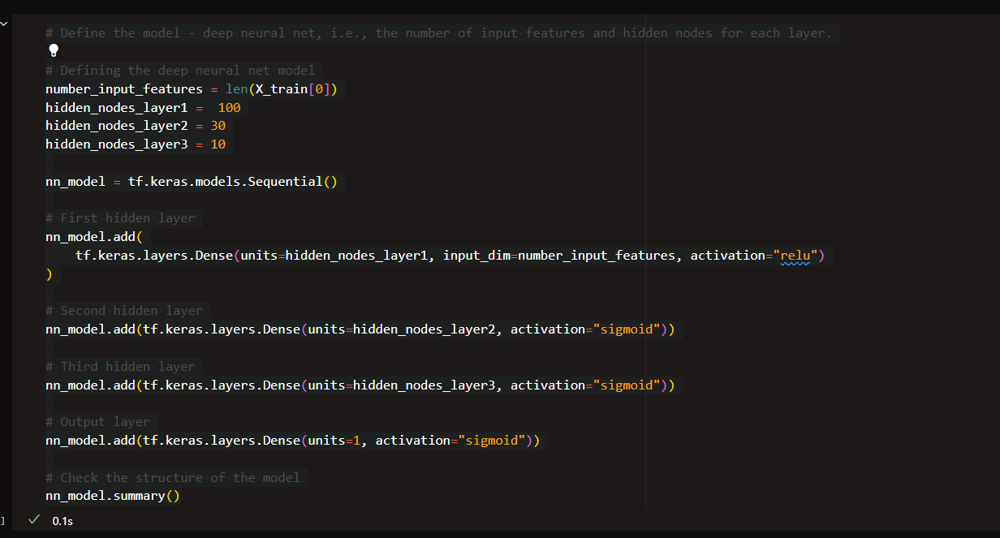
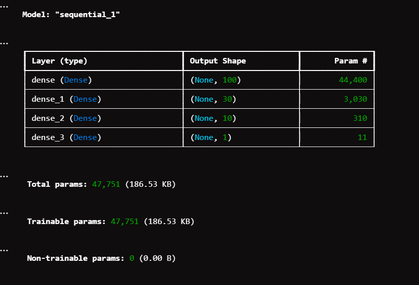
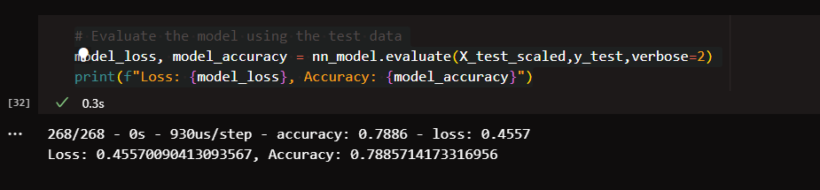

# deep-learning-challenge

# Neural Network Model Report

## Overview of the analysis:

The purpose of this analysis is to develop a deep learning model using neural networks to predict the success of funding applicants for Alphabet Soup, a nonprofit organization. The model aims to classify whether applicants will be successful in their ventures based on various features provided in the dataset.

## Results:

```
* Data Preprocessing

- Target Variable(s): The target variable for the model is "IS_SUCCESSFUL," which indicates whether an applicant was successful (1) or not (0) in receiving funding.
- Feature Variable(s): The features for the model include various columns such as "APPLICATION_TYPE," "AFFILIATION," "CLASSIFICATION," "USE_CASE," "ORGANIZATION," "ASK_AMT," "INCOME_AMT," and others.
- Variables Removed: The "EIN" (Employer Identification Number),"STATUS", and "SPECIAL_CONSIDERATIONS" columns are removed from the input data as they are neither targets nor features.
```

## Compiling, Training, and Evaluating the Model

- Neurons, Layers, and Activation Functions: The neural network model consists of multiple hidden layers with varying numbers of neurons and activation functions. Specifically, it includes layers with 100, 30, and 10 neurons respectively, followed by an output layer with a sigmoid activation function. These choices were made to create a model with sufficient capacity to learn complex patterns in the data while avoiding overfitting.




- Achievement of Target Model Performance: The target model performance of achieving greater than 75% accuracy was successfully achieved.
- Steps to Increase Model Performance: To improve model performance, various steps were taken, including adjusting the architecture, tuning hyperparameters, and preprocessing the data. Techniques such as dropout regularization and batch normalization were also employed to prevent overfitting and improve generalization. The model reached 79% accuracy which exceeds the models 75% target. 



## Increasing the model's performance:
- Initially, I included the 'NAME' column in my analysis under the assumption that there might be a correlation between the organization's name and its success. 
- Additionally, I augmented the model's complexity by introducing a third hidden layer to enhance its ability to capture intricate patterns in the data.
- Subsequently, I modified the activation functions of the second and third hidden layers, as well as the output layer, to rectify certain issues and improve model performance.

## Summary:

The deep learning model developed for Alphabet Soup achieved the target model performance with an accuracy exceeding 75% (79% accuracy). The model's architecture, including the number of neurons, layers, and activation functions, was selected based on experimentation and iterative refinement to optimize performance while preventing overfitting.

A different approach to solving this classification problem could involve using ensemble methods such as Random Forest or Gradient Boosting. These models are known for their robustness, interpretability, and ability to handle tabular data effectively. Additionally, ensemble techniques can combine multiple models to further enhance predictive accuracy and generalization, providing a complementary approach to deep learning models.

In summary, the deep learning model demonstrated promising results in predicting the success of funding applicants for Alphabet Soup. However, exploring alternative modeling techniques and ensemble methods could provide additional insights and further improve predictive performance, ultimately aiding Alphabet Soup in making informed decisions about funding allocation.